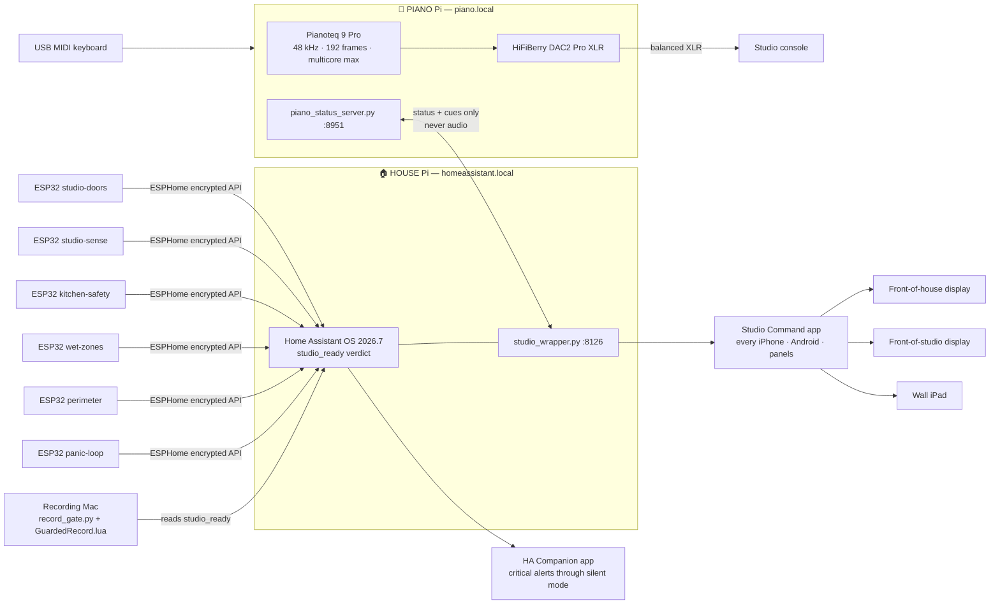

# Install diagrams

## The whole system



## Reed switches on a double door (the double-door trap)

```
        leaf A                    leaf B
   ┌──────────────┐         ┌──────────────┐
   │            [M]│⟍     ⟋│[M]            │   M = magnet, on each LEAF, top rail
   │               │ [R] [R]│               │   R = MC-38 reed, on the FRAME between
   └──────────────┘         └──────────────┘       the leaves — one per leaf
```
Two reeds per double door. If either leaf drifts open, that reed opens → studio_ready
drops. Never one reed across both leaves: it goes blind when one leaf opens alone.

## Acoustic sensor placement (per independently-recording room)

```
   door ✗  (between the doors measures the GAP — reeds live there, mics don't)
   ┌───────────────────────────────┐
   │   AC vent ✗                   │
   │            [SEN0232] ✓        │  ← ear height (~1.2–1.5 m), near the
   │            recording position │     recording position, open air,
   │   speaker blast ✗             │     away from vents/door/monitors
   └───────────────────────────────┘
```
One SEN0232 in the recording studio, one in the teaching room. Signal: 5 V → SEN0232 →
0.6–2.6 V analog → ESP32 GPIO34 (12 db attenuation). 10 mV = 1 dBA.

## Panic loop (wired by the low-voltage technician)

```
  12V battery-backed PSU ──[sounder relay NC]──[P1]──[P2]──[P3]──[P4]──┐
        │                                                              │
        └────────────────────────── loop return ───────────────────────┘
  P1..P4 = latching panic switches, wired NORMALLY-CLOSED in series.
  Any press breaks the loop → sounder fires. No Pi, no Wi-Fi, no software.
  ESP32 panic-loop node watches the same loop voltage through an opto — observe only.
```

## Certified alarm → app alerts (without touching the alarm)

```
  Certified LPG / smoke alarm ──(its own siren, standalone)──► the actual protection
            │
            └─ volt-free relay contact ──► ESP32 GPIO (pullup) ──► HA ──► phones ring
```

## WS2812B tally strip

```
  5V SMPS ──► strip 5V + ESP32 VIN (grounds COMMON)
  ESP32 GPIO18 ──► 74AHCT level shifter ──► strip DIN
  Strip in the aluminium channel above the studio door; color = studio state.
```
